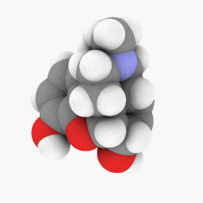
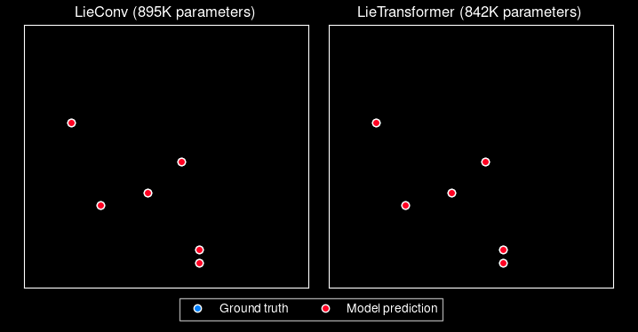
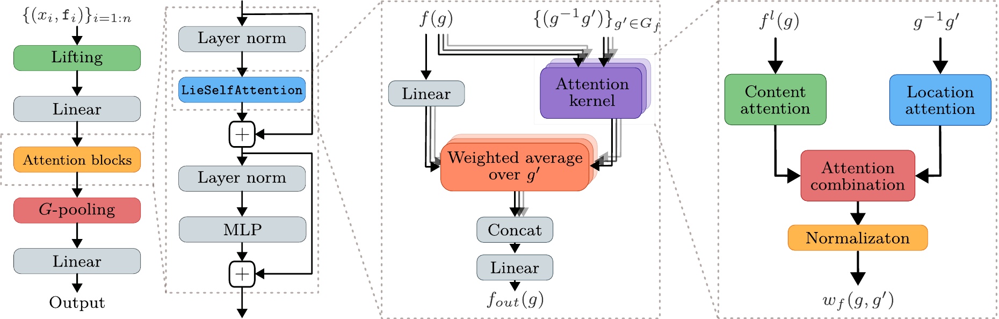
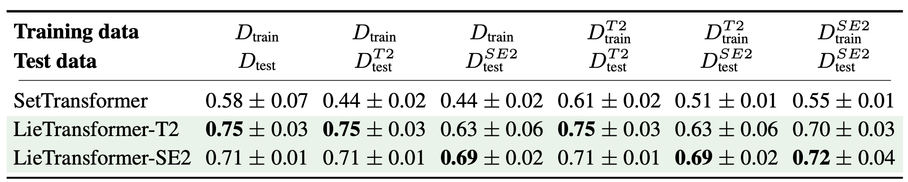
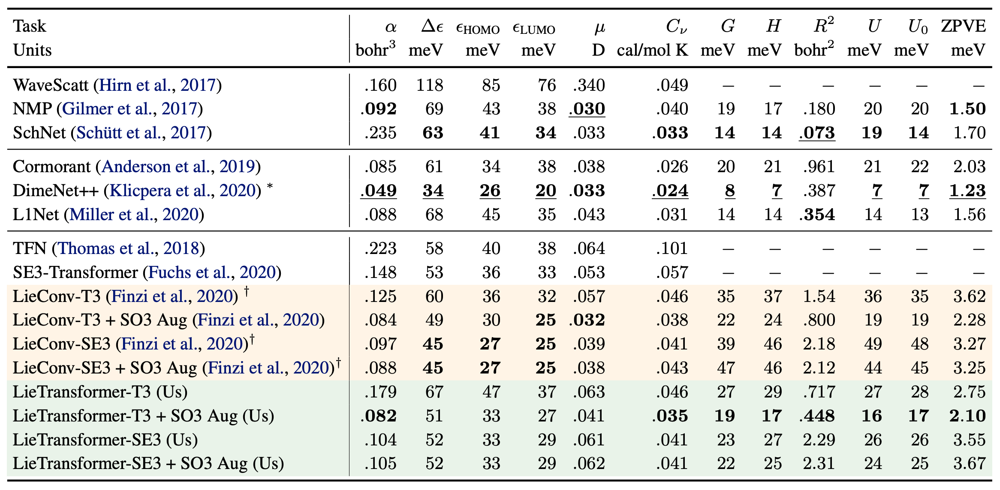
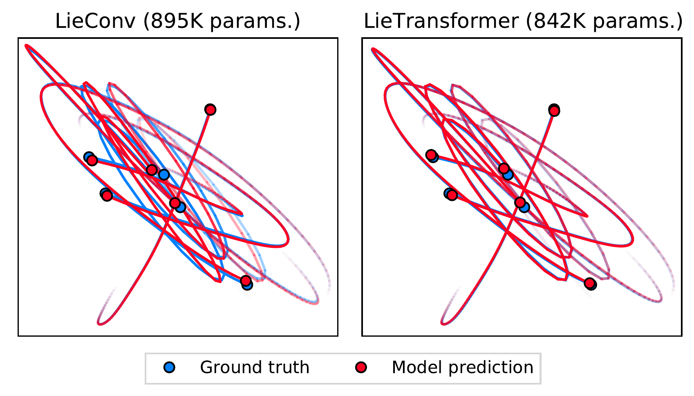

# LieTransformer

This repository contains the implementation of the LieTransformer used for experiments in the paper

[LieTransformer: Equivariant self-attention for Lie Groups]()

by [Michael Hutchinson](), [Charline Le Lan](), [Sheheryar Zaidi](), [Emilien Dupont](), [Yee Whye Teh]() and [Hyunjik Kim]()


Pattern recognition | Molecular property prediction | Particle Dynamics
:-------------------------:|:-------------------------:|:-------------------------:
 |  | 

<!-- ## Cloning this repo
To clone this project, run `git clone --recurse-submodules https://github.com/akosiorek/eqv_transformer`.
If you cloned without the `--recurse-submodules` option, then run `git submodule update --init --recursive`. -->

## Introduction

LieTransformer is a equivariant Transformer-like model, built out of equivariant self attention layers (LieSelfAttention). The model can be made equivariant to any Lie group, simply by providing and implementation of the group of interest. A number of commonly used groups are [already implemented](https://github.com/mfinzi/LieConv/blob/master/lie_conv/lieGroups.py), building off the work of [LieConv](https://github.com/mfinzi/LieConv). Switching group equivariance requires no change to model architecture, only passsing a different group to the model. 

## Architecture

The overall architecture of the LieTransformer is similar to the architecture of the original Transformer, interleaving series of attention layers and pointwise MLPs in residual blocks. The architecture of the LieSelfAttention blocks differs however, and can be seen below. For more details, please see [the paper](). 




## Installation

To repoduce the experiments in this library, first clone the repo via `git clone git@github.com:oxcsml/eqv_transformer.git`. To install the dependencies and create a virtual environment, execute `setup_virtualenv.sh`. Alternatively you can install the library and its dependencies without creating a virtual environment via `pip install -e .`.

To install the library as a dependency for another project use `pip install git+https://github.com/oxcsml/eqv_transformer`.

<!-- Alternatively, you can install all the dependencies using `pip install -r requirements.txt`. If you do so, you will need to install the LieConv, Forge, and this repo itself (using the `pip install -e` command). Please note the version of LieConv used in this project is a [slightly modified version](https://github.com/MJHutchinson/LieConv) of [the original repo](https://github.com/mfinzi/LieConv) which fixes a bug for updated PyTorch versions.   -->

## Training a model

Example command to train a model (in this case the Set Transformer on the constellation dataset):
```
python3 scripts/train.py --data_config configs/constellation.py --model_config configs/set_transformer.py --run_name my_experiment --learning_rate=1e-4 --batch_size 128
```

The model and the dataset can be chosen by specifying different config files. Flags for configuring the model and
the dataset are available in the respective config files. The project is using
[forge](https://github.com/akosiorek/forge) for configs and experiment management. Please refer to 
[this forge description](http://akosiorek.github.io/ml/2018/11/28/forge.html) and 
[examples](https://github.com/akosiorek/forge/tree/master/forge/examples) for details.

### Counting patterns in the constellation dataset

The first task implemented is counting patterns in the constellation dataset. We generate
a fixed dataset of constellations, where each constellation
consists of 0-8 patterns; each pattern consists of corners of a shape. Currently available shapes are triangle,
square, pentagon and an L. The task is to count the number of occurences of each pattern.
To save to file the constellation datasets, run before training:
```
python3 scripts/data_to_file.py
```
Else, the constellation datasets are regenerated at the beginning of the training.

#### Dataset and model consistency
When changing the dataset parameters (e.g. number of patterns, types of patterns etc) make sure that the model
parameters are adjusted accordingly. For example `patterns=square,square,triangle,triangle,pentagon,pentagon,L,L`
means that there can be four different patterns, each repeated two times. That means that counting will involve four
three-way classification tasks, and so that `n_outputs` and `output_dim` in `classifier.py` needs to be set to `4` and
`3`, respectively. All this can be set through command-line arguments. 

#### Results



### QM9
```
python scripts/train_molecule.py \
    --run_name "molecule_homo" \
    --model_config "configs/molecule/eqv_transformer_model.py" \
    --model_seed 0
    --data_seed 0 \
    --task homo
```

#### Results


### Hamiltonian dynamics
```
python scripts/dynamics/train_dynamics.py --activation_function swish --architecture model_1 --attention_fn dot_product --batch_size 100 --block_norm layer_pre --dim_hidden 160 --kernel_dim 16 --kernel_type mlp --kill_if_poor False --learning_rate 0.001 --lr_schedule cosine_annealing --model_seed 0 --n_systems 150000 --n_train 3000 --num_heads 8 --num_layers 5 --num_particles 6 --run_name test_run --save_check_points 500 --train_epochs 200
```

#### Results
Rollout MSE | Example Trajectories 
:-------------------------:|:-------------------------:
 | 

## Contributing

Contributions are best developed in separate branches. Once a change is ready, please submit a pull request with a
description of the change. New model and data configs should go into the `config` folder, and the rest of the code
should go into the `eqv_transformer` folder.
